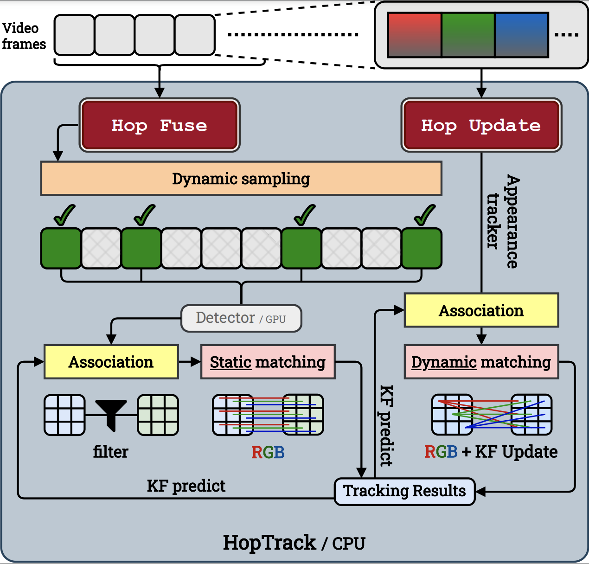

# HopTrack - A Real-time Multi-Object Tracking Framework for Embedded System

## Abstract
Multi-Object Tracking (MOT) is a challenging computer vision problem due to several factors such as occlusion and varying appearance. State-of-the-art MOT trackers proposed for high-end GPUs run on a frame-by-frame, tracking-by-detection basis, in which a detector is used to detect the objects in each frame,
followed by an association algorithm to link detection across frames and predict the future trajectory. Such algorithms, when directly executed on embedded devices, suffer from a low processing rate (<10 fps), which makes them unsuitable for real-time applications. Previous literature has attempted to run MOT on embedded devices by fusing the detector model with the feature embedding model to reduce the feature extraction latency or combining different trackers to increase tracking accuracy. However, the results are not fully satisfactory as they achieve high processing rates by sacrificing tracking accuracy or vice versa. In this paper, we designed a real-time multi-object tracking system, HopTrack, which specifically targets embedded devices. Instead of extracting deep features from the embedding model, which poses bottlenecks for processing speed, we use appearance features through a discretized static and dynamic matching approach to associate objects across several frames. Moreover, to increase the tracking accuracy, we propose a content-aware dynamic sampling technique that adaptively changes the sampling rate of the detection frame to achieve better tracking accuracy.



## Tracking performance
### HopTrack result on MOT challenge test set
| Dataset    |  MOTA | IDF1 | HOTA | MT | ML | FP | FN | IDsw | FPS* |
|------------|-------|------|------|-------|-------|------|------|------|------|
|MOT16       | 62.91 | 60.83 | 50.35 | 31.9% | 13.4% | 19063 | 46283 | 2278 | 30.61 |
|MOT17       | 63.18 | 60.38 | 50.08 | 30.4% | 14.1% | 49848 | 149985 | 6765 | 30.61 |
|MOT20       | 45.6 | 45.2 | 35.4 | 12.8% | 21.6%  | 40419 | 237887 | 2924 | 13.94 |
* All FPS reported are measured on Nvidia Jetson AGX Xavier 

### State-of-the-arts trackers' performance when process on Nvidia Jetson AGX Xavier (MOT16/17)
| Scheme     |  MOTA | IDF1 | HOTA | MT | ML | FP | FN | IDsw | FPS* |
|------------|-------|------|------|-------|-------|------|------|------|------|
|[ByteTrack](https://github.com/ifzhang/ByteTrack)   | 80.3 | 77.3 | 63.1 | 53.2% | 14.5% | 25491 | 83721 | 2196 | 10.11 |
|[StrongSort](https://github.com/dyhBUPT/StrongSORT)  | 78.3 | 78.5 | 63.5 | -- | -- | -- | -- | 1446 | 3.2 |
|[DeepSort](https://github.com/nwojke/deep_sort)    | 78.0 | 74.5 | 61.2 | -- | -- | -- | -- | 1821 | 5.9 |
|[JDE*](https://github.com/Zhongdao/Towards-Realtime-MOT) | 73.1 | 68.9 | -- | -- | --  | 6593 | 21788 | 1312 | 9.08 |

JDE is tested on MOT16 only

### Comparison of HopTrack and existing SOTA trackers for embedded devices
| Scheme     |  MOTA | IDF1 | HOTA | MT | ML | FP | FN | IDsw | FPS* |
|------------|-------|------|------|------|------|------|------|-------|------|
| Byte(Embd)   | 60.97 | 58.38 | 48.7  | 26.5 | 19.0 | 16232 | 51963 | 2958 | 30.8 |
| JDE(Embd)    | 44.9  | 45.36 | 36.13 | 9.4 | 46.2 |17034 | 80949 | 2474 | 17.93 |
| [RTMOVT](https://ieeexplore.ieee.org/document/9344696)| 45.14 | 45.54 | 36.78 | 8.2 | 39.7 |18943 | 78195 | 2886 | 24.09|
| [MobileNet-JDE](https://link.springer.com/article/10.1007/s11042-022-12095-9)| 58.3  | 48.0  | 41.0  | 25 | 24.5 |9420 | 63270 | 3358 | 12.6 |
| [REMOT](https://ieeexplore.ieee.org/document/9547347)        | 48.93 | 54.4  | --    | 18.7 | 36.5 |9410 | 82903 | 791 | 58-81 |
|**HopTrack**     | **62.91** | **60.83** | **50.35** | **31.9** | **13.4** |19063 | **46283** | 2278 | 30.61 |

Byte(Embd), JDE(Embd) are modified from ByteTrack and JDE by only perform detection on key frames and using Kalman Filter to track the rest instead of perform detection on everyframe to increase the processing rate.

### Visualization results on MOT challenge test set
  
  

## HopTrack Implementation
Since HopTrack is designed to run on embedded devices, a compatible Nvidia jetson Platforms is need in order to replicate our experiments. At the time writing this document, we performed thorough test of HopTrack on NVIDIA Jetson AGX Xavier. The enviroment of the hardware is listed below:
```
Jetpack: 4.6.2 [L4T 32.7.2]
CUDA: 10.2.300
OPENCV: 4.4.0 compiled CUDA: YES
TensorRT: 8.2.1.8 
cuDNN: 8.2.1.32
```

We implemented HopTrack with Python 3.6.9. The rest of the supporting package can be installed with the following command:

```
$pip install -r requirements.txt
```

### Tracking accuracy test
Since HopTrack is detector independent, it can be adapted with any state-of-the-arts detector that produce the bounding box outputs with the following format 
```
<tx, ty, bx, by, class_id, confidence>
```
We reserved two detector sockets in our implementation, Yolox and Yolov5, their repective weights can be downloaded from [Yolox weights](https://drive.google.com/drive/folders/1aSjvfq9nOUFEGl46R_o20grMnTnwYBUE?usp=sharing) and [Yolov5 weights](https://github.com/ultralytics/yolov5).

HopTrack has three different variations - HopDynamo, HopSwift, HopAccurate. To sepcify the variation to execute, the following command can be used:
```
python track.py --path path/to/the/video.mp4 --model yolox_s --ckpt path/to/the/weight.pth.tar --mot --dynamic
```
```
--mot
```
indicates to use the privately trained weights start with "hoptrack_xxx.tar", this only performs tracking on human. For public detectors, remove '--mot' flag and use the corresponding weights.
```
--dynamic 
```
indicates the dynamic sample strategy. using "--swift" or "--accurate" for other two sampling strategies.
```
--dis_traj
```
can be used to enable and disable the trajectory

```
--save_result
```
save the processed video sequence

## HopTrack Evaluation

To replicate the results, you need to download the original dataset from [MOT16](https://motchallenge.net/data/MOT16/), [MOT17](https://motchallenge.net/data/MOT17/) and [MOT20](https://motchallenge.net/data/MOT20/). Since the original dataset is provided in the form of individual frames, using the following command and the repected framerate of the video sequence to assemble the individual images into frames.

```
$ ffmpeg -r [framerate] -i path/to/image/img%06d.png -c:v libx264 -vf fps=[framerate] -pix_fmt yuv420p out.mp4
```

Then, run
```
python track.py --path path/to/the/video.mp4 --model yolox_s --ckpt path/to/the/weight.pth.tar --mot --dynamic > video_result.txt
```

The generated video_result.txt is mot compatible, can be directly submitted to the test server through the [MOT challenge](https://motchallenge.net/instructions/) website.

### Power, Energy and Memory test

To measure the power, energy, memory consumption, we used the tegrastats tool provided by NVIDIA. Since the record logged from the tegrastats varies based on the Jetson platform and the Jetpack version. The provided script may only work with the specified Jetpack version as mentioned earlier. To measure the power, energy and memory consumption, you can use the provided script powerlog.py. A sample command is
```
$ python powerlog.py dynamic
```
The above command requires sudo access due to the tegrastats utility. This should automatically start the tegrastats log and run the entire testing video sequences. Modify the sequence as need to test different dataset.

### GPU, CPU contention test

For CPU stress test, you will need to install the 'stress' tool using the following command
```
sudo apt install -y stress
```
Then using the following command to specify the number of CPU cores you need to stress
```
stress --cpu n
```
note that there are only 8 cpu cores on the AGX Xavier, and two of them are Denver core which by default are not enabled. Make sure your system have all cores enabled before performing this stress test.


For GPU contention test, we provide a script that can approximately generate GPU contention within 5% error:
```
python gpu_contention.py --GPU n
```
where n is the contention in percentage. (Due to the memory reading speed issue, the contention generated here may saturate after 50%).


A comprehensive raw data from our test can be downloaded [here](https://drive.google.com/drive/folders/1AGPM8e7vc2HNScV3K5LxExt4rjUUkaYo?usp=sharing)
